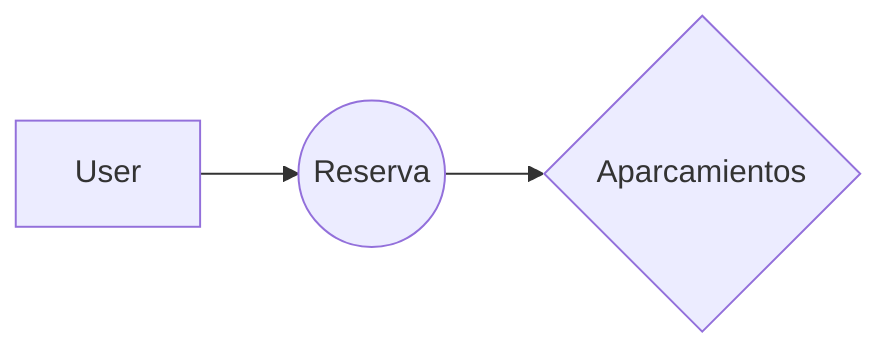
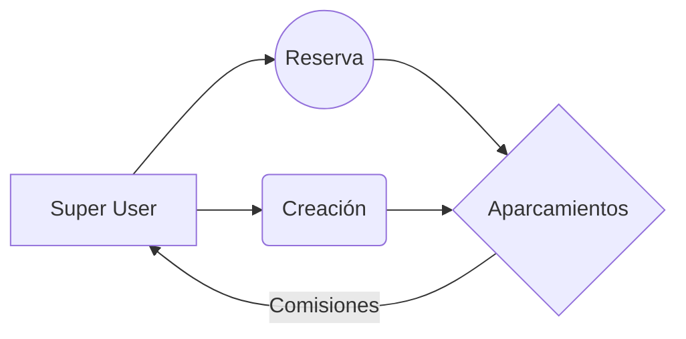

# Svelt - Gestión de Aparcamientos

¡Bienvenido/a al repositorio de Svelt! Este proyecto forma parte de mi proyecto final de grado y tiene como objetivo proporcionar una solución completa para la gestión de aparcamientos. La aplicación está desarrollada utilizando tecnologías como React, React Router, Leaflet, MUI, entre otras.

## Características principales

-   Visualización y búsqueda de aparcamientos en un mapa interactivo (Leaflet y OpenStreetMap).
-   Información detallada sobre cada aparcamiento, como ubicación, disponibilidad, horarios, tarifas, etc.
-   Reserva de plazas de aparcamiento disponibles.
-   Administración de aparcamientos por parte de los propietarios.
-   Integración con una API en PHP para el manejo de los datos.
- Sostenibilidad con el medio Ambiente ♻️

## Requisitos previos

Asegúrate de tener los siguientes requisitos previos antes de instalar y ejecutar la aplicación:

-   Node.js: [Descargar e instalar Node.js](https://nodejs.org/)
-   Git: [Descargar e instalar Git](https://git-scm.com/)

## Instalación

Sigue estos pasos para instalar la aplicación en tu entorno local:

1.  Clona este repositorio utilizando el siguiente comando:
    
    
    `git clone https://github.com/tu-usuario/nombre-del-repositorio.git` 
    
2.  Accede al directorio del repositorio:
    
    `cd nombre-del-repositorio` 
    
3.  Instala las dependencias utilizando npm:
    
    
    `npm install` 
    

## Configuración

Antes de ejecutar la aplicación, asegúrate de configurar la conexión con la API creada en PHP. Sigue estos pasos para configurarla:

1.  Abre la carpeta `api` del proyecto
    
2.  En cada archivo donde se hace la llamada tendrás como **constantes** las direcciones URL locales a las cuales se realizan las llamadas Asincronas (Asegurate de cambiarlas a tu conveniencia )

Por defecto: 
    
    `const URL=`http://localhost/Svelt_API_Backend/auth` 
*Si se ejecutase en el puerto 80 de apache (~/xampp/htdocs/Svelt_API_Backend)*    

## Ejecución

Una vez configurada la conexión con la API, puedes ejecutar la aplicación utilizando el siguiente comando:

`npm start` 

La aplicación se ejecutará en el modo de desarrollo. Abre tu navegador y accede a [http://localhost:3000](http://localhost:3000/) para verla en acción.

## Contacto

Si tienes alguna pregunta o sugerencia sobre este proyecto, no dudes en ponerte en contacto conmigo a través de mi dirección de correo electrónico [[averbec580@gmail.com](mailto:averbec580@gmail.com)].

# Diagramas de Aporte

